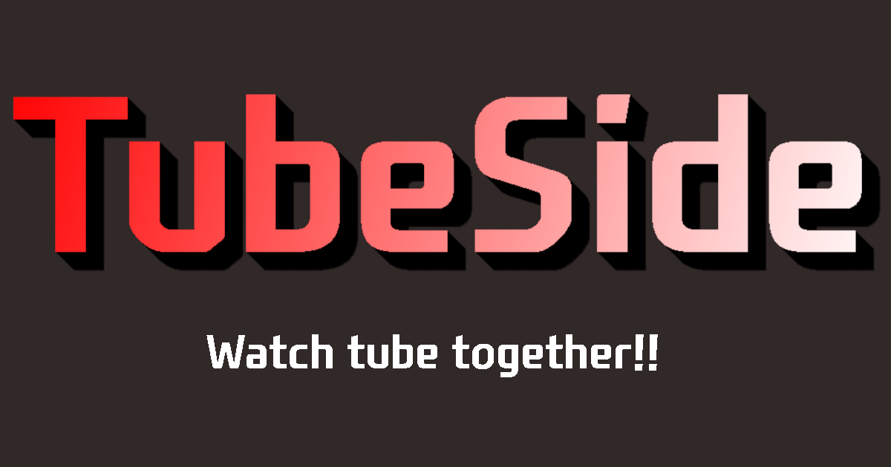

# TUBE SIDE

Service for watching youtube clip togeter.

### live in https://tubeside.app !!

## Description

- TubeSide is website for share youtube videos with other people.
- The manager can sync video with other people.
- So every people in the same space can view the same screen at the same time.
- Also, we provied the private space with invited people.
- Just create private space and share the link. No login required.

## Getting Started

### Dependencies

- Docker, Docker-compose
- Tested in Windows 10,11(WSL2), Mac OS

### Installing

1. Install Docker and Docker-Compose

[Installation Guide](https://docs.docker.com/engine/install/)

2. Clone this repository

```
git clone https://github.com/sigmarion1/tubeside
```

3. Copy .env.example to .env

```
cd back
cp .env.example .env
```

4. Deploy MongoDB Atlas or local mongoDB Server, write the endpoint to .env files

```
MONGODB_URL=mongodb+srv://CREDENTIAL.mongodb.net/tubeside
```

### Executing program

- Change directory to root folder and run using docker-compose

```
cd..
sudo docker compose up --build
```

## Help

###

Any advise for common problems or issues.

- In local development, front-end and back-end server can't communicate via websocket proxy. The front-end developemnt server is deployed localhost:3000 and The back-end is localhost:4000. So it is need to proxy port to comunicate each other. General APIs (about space information) are working properly, But the websocket communication proxy is not working currently. [related issue](https://github.com/facebook/create-react-app/issues/5280)

```
{
  "name": "front",
  "version": "0.1.0",
  "private": true,
  "proxy": "http://localhost:4000"
}
```

- In production, express server is serving build front-end files and api both, there are no issue.

## Authors

Contributors names and contact info

- [sigmarion1](matilto:axsim@naver.com)

## Version History

- 0.1
  - Initial Release

## License

This project is licensed under the MIT License - see the LICENSE.md file for details

## Acknowledgments

Inspiration, code snippets, etc.

- [create-react-app](https://github.com/facebook/create-react-app)
- [node-express-boilerplate](https://github.com/hagopj13/node-express-boilerplate)
- [react-youtube](https://www.npmjs.com/package/react-youtube)
